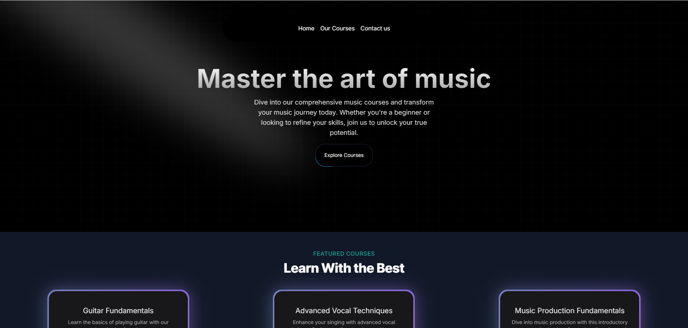

# Music Academy

 
 
 


### 🚀 [Live Demo](https://academy.jaytillu.com/)

## 🌟 Overview

A modern and responsive music academy platform built with **Next.js**, **Tailwind CSS**, and **Acecertinity UI**. This application aims to provide a smooth and engaging user experience for those interested in learning music through various courses and tutorials.

## ✨ Features

- **Responsive Design**: Built with Tailwind CSS and Next.js, ensuring compatibility across all devices and screen sizes.
- **Engaging UI**: Designed using Acecertinity UI for a smooth and visually appealing user experience.
- **Performance Optimization**: Utilizes Next.js features like code-splitting and lazy loading for improved performance.
- **Custom Animations**: Integrates smooth animations using Framer Motion for enhanced user interaction.

## ✨ Learnings

While working on this project, I gained valuable experience in:

- **Building Responsive Layouts**: Learned to create a consistent and fluid design using Tailwind CSS.
- **Next.js Optimization**: Implemented server-side rendering (SSR) and dynamic imports to boost app performance and SEO.
- **Custom UI Components**: Designed and customized UI components using Acecertinity UI to maintain a cohesive design language.
- **Animations with Framer Motion**: Integrated Framer Motion for creating custom animations, adding life to the user interface.
- **Deployment with Vercel**: Learned to deploy Next.js apps on Vercel, ensuring a smooth deployment process with custom domains and environment variables.


## 📸 Screenshots



## 🔧 Installation and Setup

To run this project locally:

1. Clone the repository:  
   ```bash
   git clone https://github.com/Jay-Tillu/Music-Academy.git
   ```

2. Navigate to the project directory:  
   ```bash
   cd Music-Academy
   ```

3. Install dependencies:
   ```bash
   npm install
   ```

4. Run the Project:
   ```bash
   npm run dev
   ```

Thanks for your time and attention.
